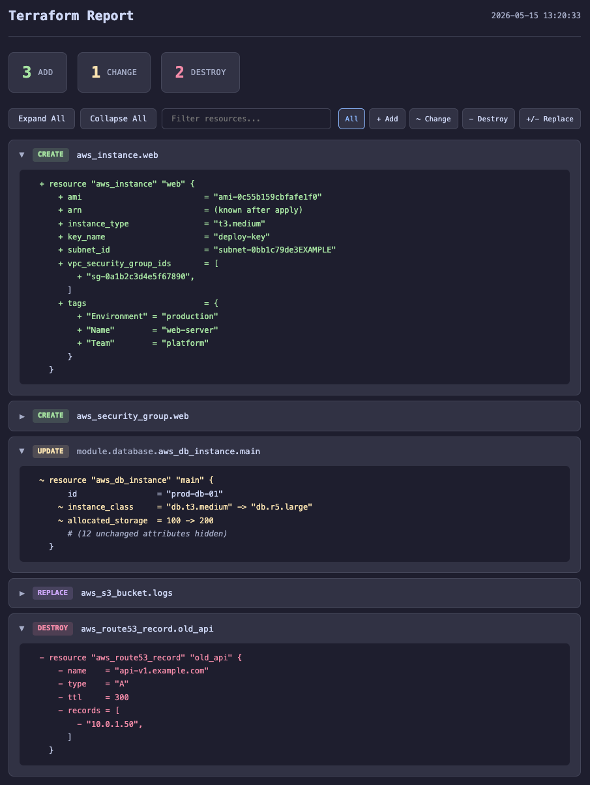

# tf-report

A single-file bash script that turns `terraform plan` output into a clean, interactive HTML report.



## Features

- Color-coded resource changes (create, update, destroy, replace)
- Collapsible diff view per resource
- Search and filter by action type
- Keyboard shortcuts (`e` expand all, `c` collapse all, `/` search)
- Auto-opens in browser

## Install

Clone and symlink:

```bash
git clone https://github.com/mohsendehbashi/terraform-report.git
ln -s "$(pwd)/terraform-report/tf-report" /usr/local/bin/tf-report
```

## Usage

```bash
# Plan and generate report
terraform plan -out plan.tfplan | tf-report

# Then apply
terraform apply plan.tfplan
```

You can also specify an output path:

```bash
terraform plan -out plan.tfplan | tf-report report.html
```

## How it works

The script reads terraform output from stdin, strips ANSI colors, parses resource changes using awk, and generates a self-contained HTML file. No dependencies beyond bash and standard unix tools.